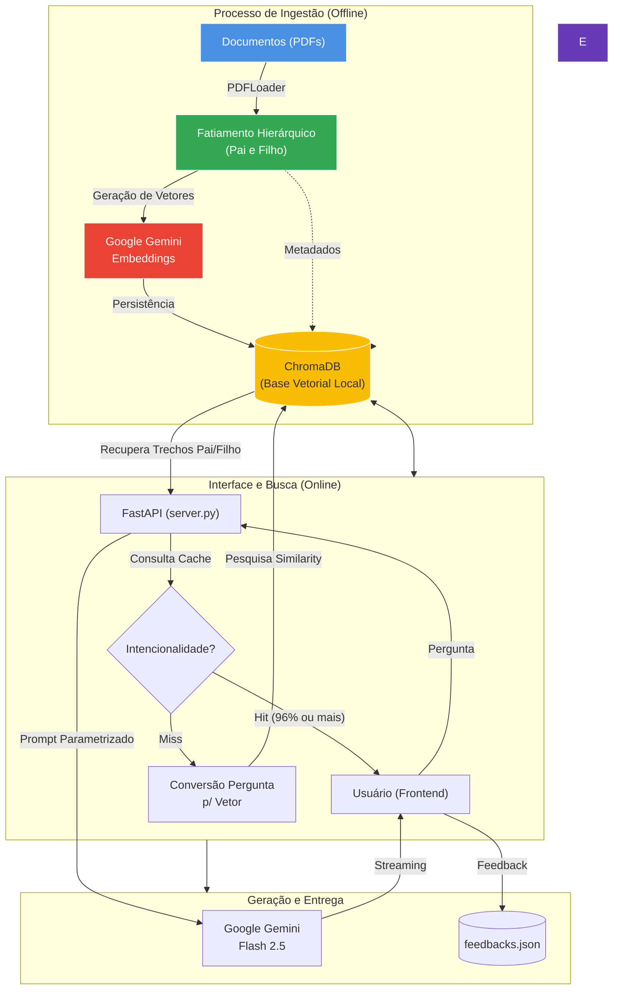

# RAG Corporativo - Agente Especialista

Este projeto implementa um **Agente Exclusivo / ChatBot Local** usando RAG (Retrieval-Augmented Generation). O sistema processa documentos (como PDFs) de forma local, realiza fatiamento, armazena seus vetores no `ChromaDB` (banco de dados vetorial local) e usa os poderosos modelos **Gemini** do Google para buscar informações altamente precisas no escopo corporativo.

A Interface Gráfica permite conversar de modo fácil enquanto a Inteligência Artificial responde baseando-se única e estritamente na base de conhecimento vetorial parametrizada.

## Principais Funcionalidades

- **RAG Específico Corporativo**: A Inteligência Artificial (Seguradora) responde perguntas exclusivamente com base no documento indexado, bloqueando "delírios" e alucinações.
- **Hierarchical RAG (Parent-Child Retrieval)**: A ingestão fatiará o conteúdo em dois níveis. Pequenos recortes geram precisão de Embeddings para busca no `ChromaDB`, mas na hora do Prompt, injetamos Pedaços Maiores ("Textos Pais") para passar contexto pleno ao LLM.
- **Cache Semântico Vetorial**: Consultas com mais de 96% de intencionalidade semântica igual a respostas passadas pulam o acionamento custoso do Google Gemini e são retornadas imediatamente do cache!
- **Auditoria de Feedback**: Balões trazem os amigáveis 👍/👎 ao final. O comportamento alimenta uma tabela local para a calibragem do Sistema.
- **Respostas em Tempo Real (Streaming)**: As respostas são exibidas com o "efeito máquina de escrever", idêntico ao fluxo nativo do ChatGPT, sem necessidade de esperar todo o processamento.
- **Memória de Conversa Per-Sessão**: O robô lembra das perguntas e respostas anteriores da mesma aba do navegador, alternando papéis corretamente.
- **Citações Dinâmicas Visuais**: Após entregar a resposta, você conta com um seletor visual na interface para atestar fidedignamente qual fragmento pai embasou a resposta original.
- **Sincronização Vetorial Incremental Inteligente**: O script `init_repo.py` analisa a "Identidade/Hash" MD5 dos arquivos.
- **Botão Inteligente de Retentativa (Resubmit)**: O frontend se adapta a quebras de internet acionando automaticamente novas tentativas. Se houver total blackout, o usuário pode repassar a pergunta num click sem copiar-colar.
- **Bypass de Resumo sob Demanda (Retry UI)**: Caso a IA sofra queda temporária na hora de gerar a Ementa Visão Geral do documento (pico 503), oferecemos na própria tela um botão "Reenviar geração do resumo" que acessa a engrenagem do ChromaDB por trás dos panos e aciona o LLM na hora.

## Arquitetura e Fluxo de Dados



## Estrutura do Projeto

* `server.py` — Código principal da API FastAPI (Backend). Responsável por receber o prompt, consultar o ChromaDB e chamar a API do Gemini.
* `init_repo.py` — Script responsável por resetar, ler PDFs, vetorizar e inserir os embeddings de conhecimento na base local ChromaDB.
* `extract_embeddings.py` (Módulo) — Funções auxiliares de integração com modelagem Embedding.
* `chroma_client.py` (Módulo) — Classes e funções CRUD intermedirárias de uso do vetor.
* `static/` — HTML, CSS e JS que compõem o frontend minimalista e bonito do projeto.
* `.env` — Variáveis de ambiente como `GEMINI_API_KEY` (este arquivo nunca é commitado).

## Como Instalar e Rodar o Projeto

### Pré-Requisitos

No terminal ou PowerShell, verifique se você possui o Python instalado e então instale as dependências.
(Certifique-se de configurar e fornecer sua API Key do Google no arquivo `.env`)

```bash
# 1. Clone o repositório
git clone https://github.com/junior-honorato/rag_ia.git
cd rag_ia

# 2. Crie um ambiente virtual (Opcional, mas recomendado)
python -m venv venv
venv\Scripts\activate  # Windows

# 3. Instale as Bibliotecas Necessárias
pip install fastapi uvicorn pydantic python-dotenv chromadb
pip install "google-genai>=0.1.2"
```

### Passo a Passo de Execução

1. **Gere a sua Base de Conhecimento**
   Certifique-se de ter um documento em PDF de teste dentro da pasta especificada. Então inicialize seu ChromaDB com:
   ```bash
   python init_repo.py
   ```
   *(Ele fará a varredura, fatiamento em N partes e armazenamento vetorizado permanente no db local).*

2. **Inicie o Servidor Interno de Chat**
   ```bash
   python -m uvicorn server:app --host 0.0.0.0 --port 8000 --reload
   ```

3. **Acesse a Aplicação**
   No seu navegador acesse `http://localhost:8000` ou compartilhe na sua rede o IP da sua máquina.

### Segurança e Limits

- **Rate Limits & API Spikes**: O backend está customizado com `Max Retries` e algorítimo *Exponential Backoff*. Se os servidores do Google sobrecarregarem, o sistema tentará silenciosamente contornar a fila antes de devolver erro final.
- **Frontend Fallbacks**: Caso a quota total da sua API Account acabe e o modelo recuse serviço (429), a tela exibirá uma mensagem de erro visível, indicando pausa do serviço ao uso geral. 

---
_Criado sob rigorosa parametrização Corporativa via Gemini & FastAPI._
