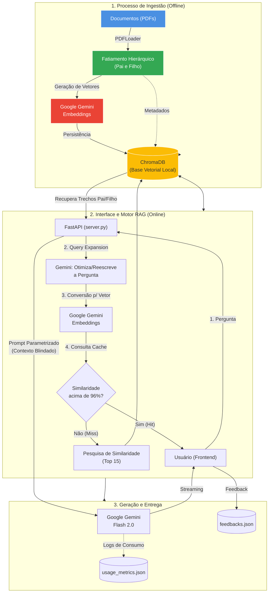

# RAG Corporativo - Agente Especialista

Este projeto implementa um **Agente Exclusivo / ChatBot Local** usando RAG (Retrieval-Augmented Generation). O sistema processa documentos (neste momento somente PDFs) de forma local, realiza fatiamento, armazena seus vetores no `ChromaDB` (banco de dados vetorial local) e usa os poderosos modelos **Gemini** do Google para buscar informações altamente precisas no escopo corporativo.

A Interface Gráfica permite conversar de modo fácil enquanto a Inteligência Artificial responde baseando-se única e estritamente na base de conhecimento vetorial parametrizada.

## Principais Funcionalidades

- **RAG Específico Corporativo**: A Inteligência Artificial responde perguntas exclusivamente com base no documento indexado, bloqueando "delírios" e alucinações.
- **Hierarchical RAG (Parent-Child Retrieval)**: A ingestão fatiará o conteúdo em dois níveis. Pequenos recortes geram precisão de Embeddings para busca no `ChromaDB`, mas na hora do Prompt, injetamos Pedaços Maiores ("Textos Pais") para passar contexto pleno ao LLM.
- **Expansão de Consultas (Query Expansion)**: O sistema utiliza o Gemini para reescrever e otimizar a pergunta original do usuário, aumentando drasticamente a taxa de acerto na recuperação semântica.
- **Cache Semântico Vetorial**: Consultas com mais de 96% de intencionalidade semântica igual a respostas passadas pulam o acionamento custoso do Google Gemini e são retornadas imediatamente do cache!
- **Auditoria de Feedback & Métricas**: Balões trazem os amigáveis 👍/👎 ao final. O comportamento alimenta o arquivo `feedbacks.json` para calibragem.
- **Observabilidade de Consumo**: Rastreamento automático de tokens (Prompt, Candidates e Total) gravados em `usage_metrics.json` para controle de custos e performance.
- **Busca Profunda (Top 15 Retrieval)**: O motor realiza o ranking dos 15 trechos mais relevantes, garantindo que nenhum fragmento crítico de contexto seja ignorado pela IA.
- **Respostas em Tempo Real (Streaming)**: As respostas são exibidas com o "efeito máquina de escrever", idêntico ao fluxo nativo do ChatGPT, sem necessidade de esperar todo o processamento.
- **Renderização Markdown**: Suporte total a negrito, itálico e listas nas respostas da IA usando `marked.js`.
- **Persistência de Histórico**: O robô lembra das perguntas e respostas anteriores da mesma aba do navegador e o histórico é persistido localmente via `LocalStorage`.
- **Citações Dinâmicas Visuais**: Após entregar a resposta, você conta com um seletor visual na interface para atestar fidedignamente qual fragmento pai embasou a resposta original.
- **Sincronização Vetorial Incremental Inteligente**: O script `init_repo.py` analisa a "Identidade/Hash" MD5 dos arquivos.
- **Botão Inteligente de Retentativa (Resubmit)**: O frontend se adapta a quebras de internet acionando automaticamente novas tentativas. Se houver total blackout, o usuário pode repassar a pergunta num click sem copiar-colar.
- **Bypass de Resumo sob Demanda (Retry UI)**: Caso a IA sofra queda temporária na hora de gerar a Ementa Visão Geral do documento (pico 503), oferecemos na própria tela um botão "Reenviar geração do resumo" que acessa a engrenagem do ChromaDB por trás dos panos e aciona o LLM na hora.
- **Dashboard de Observabilidade (Analytics)**: Interface gerencial dedicada para visualização de gráficos de consumo de tokens, volume de interações e métricas de satisfação (👍/👎).
- **Utilitário de Diagnóstico**: Inclui o script `debug_models.py` para validar a conectividade e os modelos disponíveis na sua chave de API em segundos.

## Arquitetura e Fluxo de Dados



## Estrutura do Projeto

* `server.py` — Código principal da API FastAPI (Backend). Responsável por receber o prompt, consultar o ChromaDB e chamar a API do Gemini.
* `init_repo.py` — Script responsável por ler PDFs, vetorizar e inserir os embeddings na base local ChromaDB.
* `extract_embeddings.py` (Módulo) — Funções auxiliares de integração com modelagem Embedding.
* `chroma_client.py` (Módulo) — Classes e funções CRUD intermediárias do banco vetorial.
* `static/` — HTML, CSS e JS do frontend.
    * `index.html` — Tela de chat principal.
    * `dashboard.html` — Painel de métricas.
    * `main.js` e `dashboard.js` — Lógicas de interação e gráficos.
* `repositorio/` — **Diretório Geral de Dados**:
    * Coloque seus **PDFs** aqui para indexação.
    * `usage_metrics.json`: Histórico de consumo de tokens.
    * `feedbacks.json`: Registro de votos 👍/👎.
* `chroma_db/` — Banco de dados vetorial local (gerado automaticamente).
* `.env` — Variáveis de ambiente secretas.

## Como Instalar e Rodar o Projeto

### Pré-Requisitos

1.  **Python 3.10+**: Certifique-se de ter o Python instalado.
2.  **Google Gemini API Key**: Gere sua chave no [Google AI Studio](https://aistudio.google.com/).

### Configuração de Variáveis de Ambiente (.env)

Crie um arquivo chamado `.env` na raiz do projeto e configure as seguintes variáveis:

```env
# Chave de API do Google Gemini (Obrigatória)
GEMINI_API_KEY="SUA_CHAVE_AQUI"

# Nome do modelo Gemini (Opcional, padrão: gemini-2.0-flash)
GEMINI_MODEL_NAME="gemini-2.0-flash"

# Chave interna para as sessões do Dashboard/API (Opcional)
APP_INTERNAL_API_KEY="app-internal-dev-key"
```

### Instalação

```bash
# 1. Clone o repositório
git clone https://github.com/junior-honorato/rag_ia.git
cd rag_ia

# 2. Crie um ambiente virtual (Opcional, mas recomendado)
python -m venv venv
venv\Scripts\activate  # Windows

# 3. Instale as Bibliotecas Necessárias
pip install fastapi uvicorn pydantic python-dotenv chromadb langchain langchain-community pypdf "google-genai>=0.1.2"
```

### Passo a Passo de Execução

1. **Gere a sua Base de Conhecimento**
   Certifique-se de ter um documento em PDF de teste dentro da pasta especificada. Então inicialize seu ChromaDB com:
   ```bash
   python init_repo.py
   ```
   *(Ele fará a varredura, fatiamento em N partes e armazenamento vetorizado permanente no db local).*

2. **Inicie o Servidor Interno de Chat**
   ```bash
   python -m uvicorn server:app --host 0.0.0.0 --port 8000 --reload
   ```

3. **Acesse a Aplicação**
   No seu navegador acesse `http://localhost:8000`.

4. **Acesse o Dashboard de métricas**
   Acesse `http://localhost:8000/dashboard.html` ou clique no botão **Estatísticas** no canto superior do chat.

5. **Validação de Modelo (Opcional)**
   Para listar os modelos disponíveis e testar sua chave de API rapidamente, execute:
   ```bash
   python debug_models.py
   ```

### Execução via Docker (Opcional)

Para facilitar o deploy ou garantir um ambiente idêntico, você pode usar o Docker:

```bash
# 1. Construir a imagem
docker build -t multimodal-rag-app .

# 2. Rodar o container
docker run -p 8000:8000 --env-file .env multimodal-rag-app
```

### Segurança e Limits

- **Rate Limits & API Spikes**: O backend está customizado com `Max Retries` e algorítimo *Exponential Backoff*. Se os servidores do Google sobrecarregarem, o sistema tentará silenciosamente contornar a fila antes de devolver erro final.
- **Frontend Fallbacks**: Caso a quota total da sua API Account acabe e o modelo recuse serviço (429), a tela exibirá uma mensagem de erro visível, indicando pausa do serviço ao uso geral. 

## Segurança e Blindagem

Este Agente foi projetado para operar em ambientes corporativos, possuindo camadas de segurança ativas:

1. **Autenticação de Sessão (Cookies HttpOnly)**: Todas as chamadas entre o Frontend e o Backend são protegidas por cookies de sessão seguros (`HttpOnly`). Isso elimina chaves hardcoded no código JavaScript, impedindo que usuários mal-intencionados visualizem ou copiem credenciais via "Inspecionar Elemento".
2. **Proteção contra XSS (DOMPurify)**: No frontend, todas as respostas do modelo Gemini passam por uma sanitização rigorosa utilizando a biblioteca `DOMPurify`. Isso garante que eventuais scripts ou códigos maliciosos injetados nos PDFs ou gerados pela IA não sejam executados no navegador do usuário.
3. **Blindagem de Prompt (Guardrails)**: O `system_prompt` possui diretrizes estritas de "blindagem" para impedir ataques de *Prompt Injection*. A IA está instruída a ignorar tentativas de desvio de conduta (ex: "ignore all previous instructions") e a nunca revelar suas instruções internas.
4. **Isolamento de Dados**: Os arquivos de PDF originais, o banco vetorial e os logs de métricas são mantidos localmente e estão configurados no `.gitignore` para nunca serem expostos no repositório público.

## Solucionando Problemas (FAQ)

- **A IA não responde ou dá erro 503/429?**
  Isso geralmente é sobrecarga temporária na API do Google ou fim da quota gratuita. O sistema tentará 3 vezes automaticamente com atrasos crescentes (*backoff*). Caso persista, aguarde alguns minutos.
- **O Dashboard está zerado?**
  As métricas são geradas conforme você interage com o Chat. Faça algumas perguntas para ver os gráficos ganharem vida.
- **Meus novos PDFs não aparecem na busca?**
  Sempre que adicionar ou alterar arquivos na pasta `repositorio/`, você deve rodar o comando `python init_repo.py` para sincronizar a base vetorial.

---
_Criado sob rigorosa parametrização Corporativa via Gemini & FastAPI._
